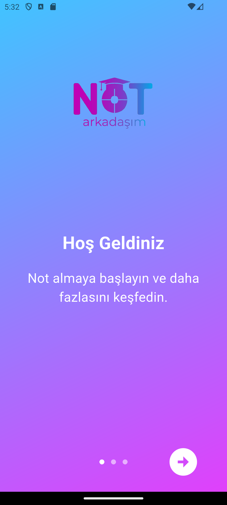
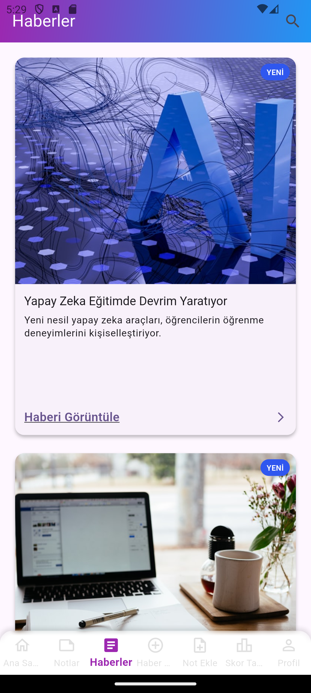
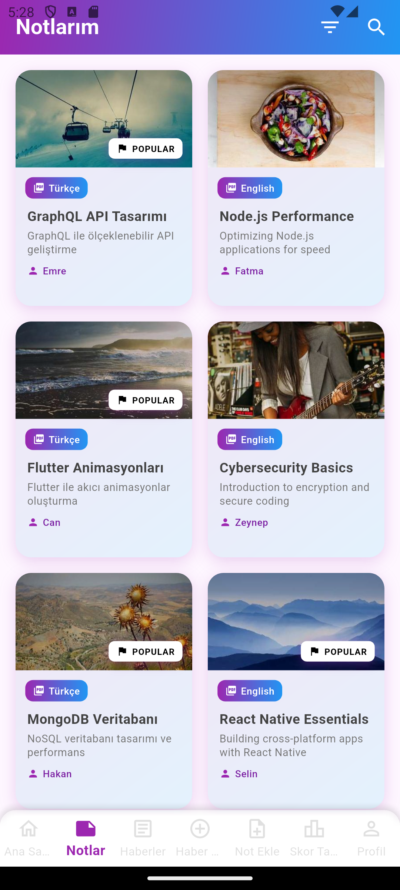
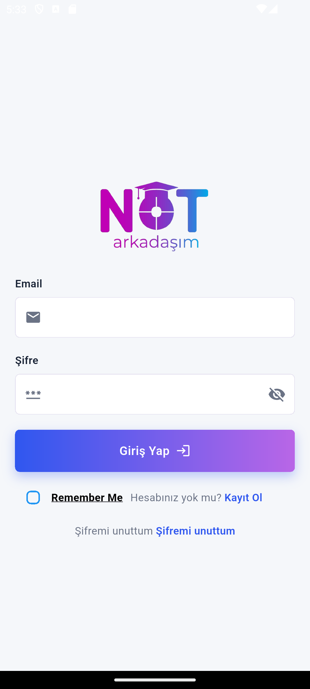
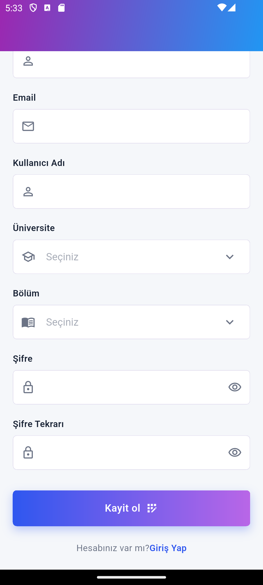
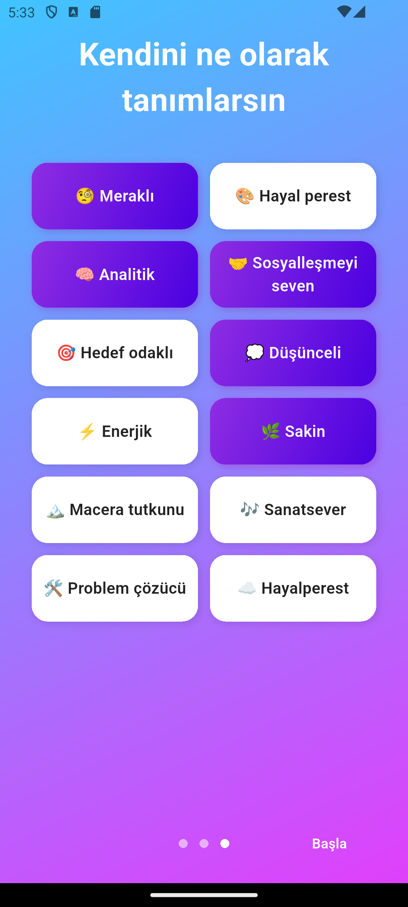
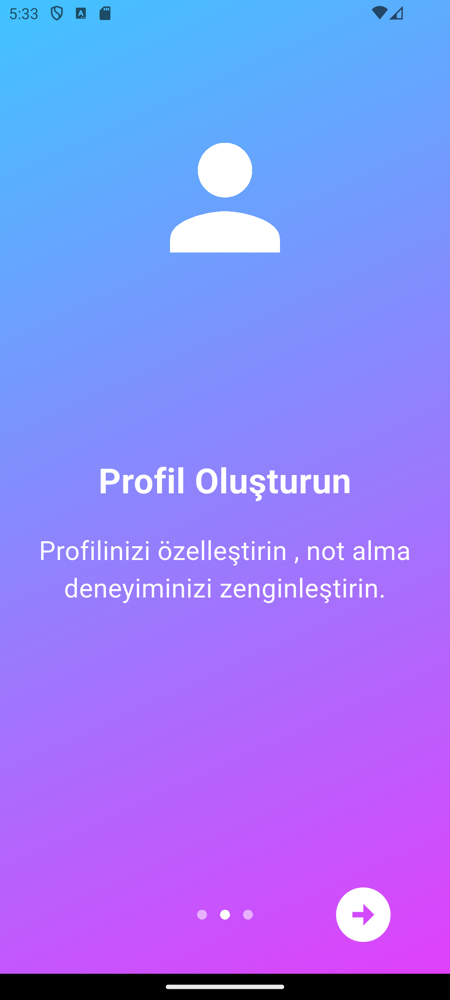
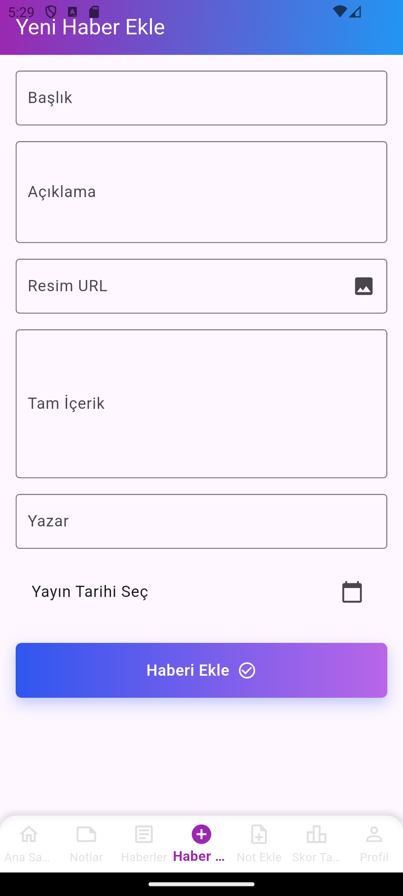
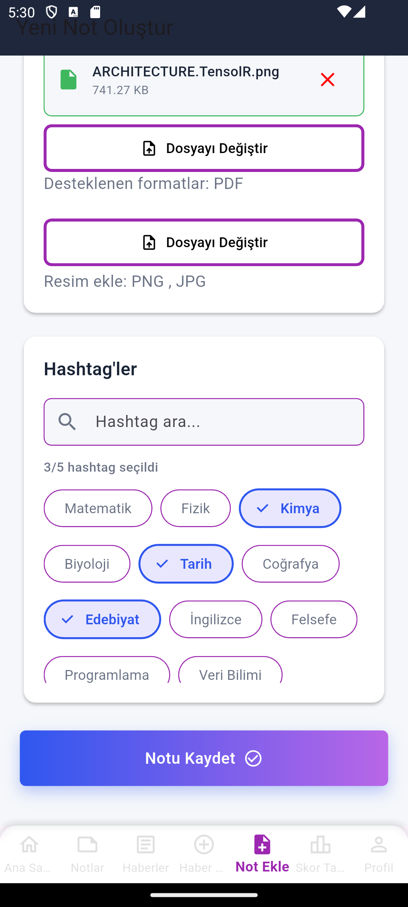
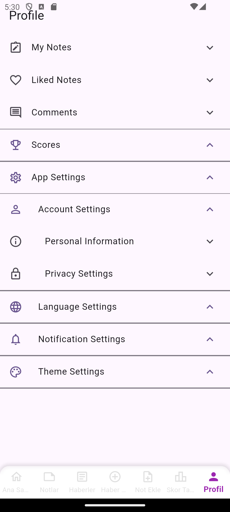

# Uygulamanın Ekran Görüntüleri

Uygulamanın tüm ekranlarını aşağıda görebilirsiniz:

---

## 🏠 Ana Ekranlar

### Hoş Geldiniz Ekranı
Kullanıcıları karşılayan sıcak arayüz

### Ana Sayfa / Haber Akışı
Güncel eğitim haberleri ve navigasyon menüsü

### Notlarım Ekranı
Kullanıcının tüm notlarını listeleyen ana ekran

---

## 👤 Kullanıcı İşlemleri

### Giriş Yap Ekranı
Email ve şifre ile giriş sayfası

### Kayıt Ol Ekranı
Yeni kullanıcı kayıt formu

### Profil Oluşturma
Kullanıcı özelliklerini seçme ekranı

### Profil Özelleştirme
Profil kişiselleştirme arayüzü

---

## 📝 İçerik Yönetimi

### Yeni Haber Ekle
Editörler için haber ekleme formu

### Not Ekleme Ekranı
Dosya yükleme ve hashtag seçme arayüzü

---

## ⚙️ Ayarlar

### Ayarlar Menüsü
Kapsamlı ayar seçenekleri

---

## 🎨 Tasarım Özellikleri

* Modern ve minimalist arayüz
* Kullanıcı dostu navigasyon
* Responsive tasarım
* Tutarlı renk paleti
* Sezgisel ikon kullanımı
